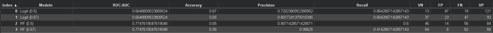

# German Credit Risk Classification
Comparison of Machine Learning models (Random Forest vs Logistic Regression) for detecting credit risk, optimizing the decision threshold to reduce financial losses.

# Overview
This project implements a full machine learning pipeline to assess credit risk and support automated loan approval decisions. By comparing Logistic Regression (interpretable baseline) and Random Forest (non-linear model), the goal is to identify the best approach to balance risk mitigation with business growth.
The model doesn't just classify applicants — it provides actionable insights for credit policy design through threshold optimization.

# Business Problem
Challenge: Financial institutions face a critical trade-off when evaluating loan applications.

Approve too liberally → Higher default rates, significant financial losses
Reject too conservatively → Lost revenue opportunities, competitive disadvantage

Solution: A data-driven credit scoring model that:

Predicts default probability for each applicant
Allows threshold tuning based on risk appetite
Quantifies the business impact of different approval policies

Impact:

Random Forest (0.5 threshold) filters 76.7% of risky clients (rejects 46 of 60 bad borrowers in the test set) while maintaining a ROC-AUC of 0.775
Flexibility to adjust between extreme risk aversion (0.67 threshold, 90% precision) and volume optimization (0.5 threshold, 86% recall)

# Dataset
Source: German Credit Data (Kaggle)

1,000 observations
Financial and demographic features
Target variable: Risk (good / bad)
Test set: 200 observations (stratified split)

# Methodology

Data cleaning and preprocessing
Explicit treatment of missing values in Saving accounts and Checking account as informative categories
Feature engineering and encoding of categorical variables (ordinal mapping + one-hot encoding)
Train/test split with stratification (80/20)
Models implemented:

Logistic Regression (baseline, interpretable)
Random Forest (300 estimators, max_depth=6, balanced class weights)

Model evaluation: ROC-AUC, Precision, Recall, Accuracy, Confusion Matrix
Decision threshold analysis (0.5 vs 0.67) to simulate real credit policies

# Results

Key findings:

Random Forest achieves significantly better class separation (ROC-AUC 0.775 vs 0.665)
Logistic Regression (0.5) captures more good clients (Recall 0.864) but at the cost of approving more bad ones (FN=19)
RF (0.67) reaches 90.6% precision — nearly eliminating false positives (FP=6) — but rejects 82 good clients
Most important features: Checking account status, loan duration, credit amount, age

# Business Insight
Model performance is evaluated not only through global metrics, but also through its economic impact. Adjusting the decision threshold allows balancing risk control and loan approval volume, which reflects real-world credit risk management.
The Choice: Random Forest with a 0.5 threshold was selected as the optimal model. It provides the best ROC-AUC (0.775), filters 76.7% of risky clients (46/60), and keeps false positives low (14) — offering a balanced trade-off between risk mitigation and approval volume.
Risk Policy: A higher threshold (0.67) could be adopted if the bank's priority shifts toward extreme risk aversion, achieving 90.6% precision. However, this comes at a significant cost: 82 good clients rejected (vs. 14 with the 0.5 threshold), representing substantial lost revenue.

# Technologies

Python
pandas, numpy
scikit-learn
Machine Learning
Credit Risk Modeling
